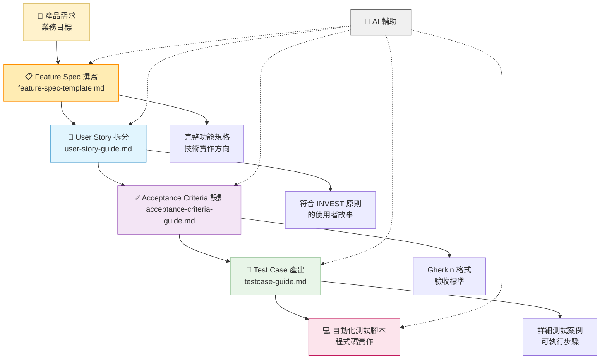

# AI 驅動敏捷開發工作坊
## 使用 Jira Dashboard 進行快速原型開發

歡迎參加這個使用 AI 驅動開發工具建構全端應用程式的綜合工作坊！本專案展示如何使用現代技術和 AI 輔助來快速原型開發類似 Jira 的儀表板。

## 🎯 工作坊目標

學習如何：
- **快速 UI 原型開發** 使用 v0.dev 即時生成 React 元件
- **全端開發** 使用 Next.js 15 和 Python FastAPI
- **容器化開發環境** 使用 Docker 簡化環境設定
- **API 整合** 與即時資料更新
- **AI 輔助開發** 工作流程以加速迭代

## 🏗️ 專案結構

```
training-jira-dashboard-workshop-base/
├── 📂 frontend/                 # Next.js + React + TypeScript + shadcn/ui
├── 📂 backend/                  # Python + FastAPI API
├── 📂 backend-dotnet/           # .NET Core + Google Sheets 整合 API
├── 📂 docs/                    # 技術文件
├── 📄 CLAUDE.md                # Claude Code AI 助手指引
└── 📄 package.json             # 專案配置
```

## 🚀 Quick Start (Docker Environment)

### Prerequisites
- **Docker Desktop** (唯一需要安裝的工具)
- Git
- Text editor (VS Code/Cursor recommended)

### Setup (學員只需要執行這些指令)

**macOS/Linux 學員:**
```bash
# 1. Clone the repository
git clone https://github.com/your-username/training-jira-dashboard-workshop-base.git
cd training-jira-dashboard-workshop-base

# 2. 啟動 Docker 環境 (一次啟動，全程使用)
make workshop-start

# 3. 等待服務啟動完成 (約 30-60 秒)
```

**Windows 學員:**
```cmd
# 1. Clone the repository
git clone https://github.com/your-username/training-jira-dashboard-workshop-base.git
cd training-jira-dashboard-workshop-base

# 2. 啟動 Docker 環境 (一次啟動，全程使用)
workshop.bat workshop-start

# 3. 等待服務啟動完成 (約 30-60 秒)
```

Visit:
- 🖥️ **Frontend**: http://localhost:3000 (Jira Dashboard - Google Sheets 整合)
- 📊 **Google Sheets Table**: http://localhost:3000/google-sheets (實際資料整合)
- 🔧 **Backend API (.NET)**: http://localhost:8001/api/dashboard/stats
- 📚 **API 文件**: http://localhost:8001/swagger

**注意**：Jira Dashboard 頁面已完成 Google Sheets 整合，顯示真實資料並支援 Sprint 篩選功能。

### 📋 更新資料來源 (Google Sheets)

系統支援動態更新資料來源，無需重啟服務即可切換到不同的 Google Sheets：

1. **進入 Google Sheets Table 頁面**：http://localhost:3000/google-sheets
2. **點擊右上角的 "Configure Data Source" 按鈕**
3. **貼上新的 Google Sheets URL**：
   ```
   例如：https://docs.google.com/spreadsheets/d/YOUR_NEW_SHEET_ID/edit#gid=0
   ```
4. **點擊 "Update Configuration"** 
5. **系統會自動**：
   - 解析 Sheet ID
   - 更新資料來源
   - 重新載入資料
   - 顯示成功訊息

**注意事項**：
- ✅ **即時生效** - 無需重啟服務
- ✅ **自動解析** - 支援各種 Google Sheets URL 格式
- ✅ **錯誤提示** - 無效 URL 會顯示錯誤訊息
- 📋 **資料格式** - 新的 Google Sheets 需要相同的欄位結構才能正常顯示

**支援的 URL 格式**：
```
https://docs.google.com/spreadsheets/d/SHEET_ID/edit
https://docs.google.com/spreadsheets/d/SHEET_ID/edit#gid=0
https://docs.google.com/spreadsheets/d/SHEET_ID/edit?usp=sharing
```

### 🧪 第一個任務：測試開發環境

環境啟動成功後，讓我們確認即時開發功能是否正常運作：

1. **開啟檔案** `frontend/app/page.tsx`
2. **找到第 9 行**：
   ```tsx
   🎉 Docker 環境測試成功！修改已即時生效
   ```
3. **修改文字**：將上面的文字改成任何你想要的內容，例如：
   ```tsx
   🚀 我的第一次修改成功了！
   ```
4. **儲存檔案** (Ctrl+S 或 Cmd+S)
5. **查看結果**：開啟瀏覽器訪問 http://localhost:3000
   - 你應該會在頁面頂部看到綠色橫幅顯示你的新文字
   - 不需要重新啟動或重新整理，改變會自動出現！

✅ **恭喜！** 如果你看到文字已更新，表示你的開發環境已正確設定，可以開始工作坊了。

### 🎯 學員開發流程

**macOS/Linux 學員:**
```bash
# 課程開始時啟動一次
make workshop-start

# 課程中修改程式碼 (即時生效，無需重啟)
# 修改 frontend/app/page.tsx → 瀏覽器自動更新
# 修改 backend/main.py → API 自動重新載入
# 修改 backend-dotnet/Program.cs → .NET API 自動重新編譯與載入

# 課程結束時停止
make workshop-stop
```

**Windows 學員:**
```cmd
# 課程開始時啟動一次
workshop.bat workshop-start

# 課程中修改程式碼 (即時生效，無需重啟)
# 修改 frontend/app/page.tsx → 瀏覽器自動更新
# 修改 backend/main.py → API 自動重新載入
# 修改 backend-dotnet/Program.cs → .NET API 自動重新編譯與載入

# 課程結束時停止
workshop.bat workshop-stop
```

#### 針對 .NET 後端開發的學員

對於專注於 `backend-dotnet` 開發的學員，我們建議單獨啟動 .NET 服務以加快速度。其完整開發流程如下：

1. **啟動 .NET 後端服務**：在終端機中執行以下指令。
   ```bash
   docker-compose up --build backend-dotnet
   ```
2. **修改 C# 程式碼**：在 `backend-dotnet` 資料夾中修改程式碼並儲存。
3. **觀察自動重載**：回到終端機，你會看到 `dotnet watch` 偵測到變更並自動重新編譯服務。
4. **測試 API 變更**：在瀏覽器或 API 工具中訪問 `http://localhost:8001` 來驗證你的修改。
5. **結束開發**：完成後，在終端機按下 `Ctrl + C` 即可停止服務。

### 🔄 何時需要重新建構服務？

**即時生效 (無需重啟)：**
- ✅ 修改前端檔案 (`.tsx`, `.ts`, `.css`) → 瀏覽器自動更新
- ✅ 修改 Python 後端檔案 (`.py`) → API 自動重新載入  
- ✅ 修改 .NET 後端檔案 (`.cs`) → dotnet watch 自動重新編譯

**需要重啟服務：**
- 🔄 修改 Docker 相關檔案 (`Dockerfile`, `docker-compose.yml`)
- 🔄 新增套件依賴 (`package.json`, `requirements.txt`, `.csproj`)
- 🔄 修改環境變數 (`.env` 檔案)
- 🔄 新增 API 端點到 .NET 後端 (`Program.cs` 的路由設定)

**重啟指令：**
```bash
# 只重啟特定服務 (較快)
docker-compose restart backend-dotnet    # 重啟 .NET 後端
docker-compose restart frontend          # 重啟前端

# 重新建構並重啟 (有新增套件時)
docker-compose build backend-dotnet && docker-compose restart backend-dotnet

# 完全重置 (故障排除)
make workshop-reset
```

### 🛠️ 常用指令

**macOS/Linux 學員:**
```bash
# 檢查服務狀態
make health

# 查看即時 logs
make logs

# 重置環境 (故障排除用)
make workshop-reset

# 進入容器 (進階使用)
make shell-frontend
make shell-backend

# 執行測試
make test             # 執行所有測試
make test-frontend    # 只執行前端測試
make test-backend     # 只執行後端測試
```

**Windows 學員:**
```cmd
# 檢查服務狀態
workshop.bat health

# 查看即時 logs
workshop.bat logs

# 重置環境 (故障排除用)
workshop.bat workshop-reset

# 重啟特定服務 (與 macOS/Linux 相同)
docker-compose restart backend-dotnet    # 重啟 .NET 後端
docker-compose restart frontend          # 重啟前端

# 重新建構並重啟
docker-compose build backend-dotnet && docker-compose restart backend-dotnet

# 查看服務狀態
workshop.bat ps

# 執行測試
workshop.bat test             # 執行所有測試
workshop.bat test-frontend    # 只執行前端測試
workshop.bat test-backend     # 只執行後端測試
```

## 📚 快速開始指南

本專案已完成開發，是一個功能完整的 Jira Dashboard MVP v1.0 版本：

👉 **直接使用 Quick Start 指令即可開始使用**

### 功能概覽
- ✅ **4 個關鍵指標卡片** - 總 Issue 數、總故事點數、已完成 Issue 數、已完成故事點數
- ✅ **狀態分布圖表** - 視覺化 Issue 狀態分布（Bar Chart）
- ✅ **Sprint 篩選功能** - 動態篩選不同 Sprint 的資料
- ✅ **Google Sheets 整合** - 即時讀取真實專案資料
- ✅ **動態資料來源切換** - 無需重啟即可更換 Google Sheets 資料來源
- ✅ **響應式設計** - 支援桌面和行動裝置

**無需額外設定步驟，使用 Docker 環境即可立即體驗完整功能！**

## 🛠️ 技術棧

### 前端 (v0.dev 生成)
- **⚛️ Next.js 15** - 使用 app router 的 React 框架
- **🎨 shadcn/ui** - 高品質元件庫
- **🎨 Tailwind CSS** - 實用優先的 CSS 框架
- **📊 Recharts** - 資料視覺化
- **🔷 TypeScript** - 型別安全
- **🧪 Jest + React Testing Library** - 測試框架

### 後端 (工作坊建構)
- **🔷 .NET Core + ASP.NET** - 現代 .NET Web API 框架
- **📄 Google Sheets 整合** - 真實資料來源
- **🔄 RESTful APIs** - 標準 HTTP 端點
- **📊 CSV 資料處理** - 直接讀取 Google Sheets CSV
- **⚡ 記憶體快取** - 5分鐘資料快取機制

### 開發工具
- **🐳 Docker** - 容器化開發環境
- **🤖 v0.dev** - AI 驅動的 UI 元件生成
- **🤖 Claude Code** - AI 開發助手
- **📦 npm** - 套件管理

## ✨ 主要功能

### 儀表板功能
- 📊 **問題管理** - 建立、更新和追蹤問題
- 📈 **資料視覺化** - 圖表和統計
- 🔍 **篩選和搜尋** - 進階問題篩選
- 👥 **使用者管理** - 使用者檔案和指派
- 🔗 **資料來源管理** - 動態切換 Google Sheets 資料來源
- 📱 **響應式設計** - 行動裝置友善介面

### 技術功能
- 🔄 **即時更新** - 立即 UI 回饋
- 🚀 **樂觀更新** - 流暢的使用者體驗
- 🛡️ **錯誤處理** - 全面的錯誤管理
- 🔧 **自動重新整理** - 保持資料最新
- 📡 **RESTful API** - 標準後端架構

## 🎓 學習成果

完成本工作坊後，你將了解：

- ✅ 如何運用 AI 工具進行快速原型開發
- ✅ 使用 Next.js 15 的現代 React 模式
- ✅ 使用 Python FastAPI 建構 API
- ✅ Docker 容器化開發環境
- ✅ 全端應用程式架構
- ✅ 即時資料同步模式
- ✅ 使用 AI 輔助的專業開發工作流程
- ✅ Google Sheets 整合真實資料

## 🔧 Development Commands (Docker Environment)

**macOS/Linux 學員:**
```bash
# 主要指令 (學員使用)
make workshop-start    # 啟動所有服務
make workshop-stop     # 停止所有服務
make workshop-reset    # 重置環境
make health           # 檢查服務狀態

# 查看 logs
make logs             # 查看所有服務 logs
make logs-frontend    # 查看前端 logs
make logs-backend     # 查看後端 logs

# 進入容器 (進階使用)
make shell-frontend   # 進入前端容器
make shell-backend    # 進入後端容器
```

**Windows 學員:**
```cmd
# 主要指令 (學員使用)
workshop.bat workshop-start    # 啟動所有服務
workshop.bat workshop-stop     # 停止所有服務
workshop.bat workshop-reset    # 重置環境
workshop.bat health           # 檢查服務狀態

# 查看 logs
workshop.bat logs             # 查看所有服務 logs
workshop.bat ps               # 查看服務狀態
```

**所有平台通用:**
```bash
# 直接使用 docker-compose
docker-compose up --build    # 建構並啟動
docker-compose down          # 停止服務
docker-compose logs -f       # 查看即時 logs
```

## 🤖 AI 輔助產品開發流程

本工作坊採用結構化的 AI 輔助開發流程，確保從需求分析到測試實作的完整連貫性：

### 📋 四階段開發流程



#### **階段 1: Feature Spec 撰寫** 📋
**使用指引：** `docs/feature-spec-template.md`

- **目標**：將產品需求整理為完整的功能規格文件
- **產出**：包含背景、目標、技術實作方向的完整規格
- **AI 角色**：協助結構化需求，確保考量完整性
- **涵蓋內容**：需求背景、功能描述、技術影響、成效追蹤

#### **階段 2: User Story 拆分** 📝
**使用指引：** `docs/user-story-guide.md`

- **目標**：將 Feature Spec 拆分為可執行的使用者故事
- **產出**：符合 INVEST 原則的 User Story 集合
- **AI 角色**：協助拆分功能，確保故事獨立且有價值
- **範例格式**：`ID-XXX: 作為 [角色]，我希望 [功能]，以便 [價值]`

#### **階段 3: Acceptance Criteria 設計** ✅
**使用指引：** `docs/acceptance-criteria-guide.md`

- **目標**：將每個 User Story 具體化為可驗證的驗收標準
- **產出**：Gherkin 格式的驗收標準（Given-When-Then）
- **AI 角色**：生成完整場景，涵蓋正常流程、邊界條件、異常處理
- **涵蓋範圍**：✅ 正常流程 ⚠️ 邊界條件 ❌ 異常情況 🔒 權限驗證

#### **階段 4: Test Case 產出** 🧪
**使用指引：** `docs/testcase-guide.md`

- **目標**：將 AC 轉換為具體的測試案例
- **產出**：詳細的測試步驟與預期結果
- **AI 角色**：生成可執行的測試案例，為自動化測試做準備
- **測試類型**：功能測試、邊界測試、異常測試、權限測試

### 🔄 完整流程示範

**輸入：** 產品需求「提升使用者登入體驗」

**第 1 階段產出 (Feature Spec)：**
```markdown
# AI-001-使用者登入優化 - Feature Spec

## 📝 功能概述
### 需求背景
目前登入流程複雜，使用者反饋登入時間過長，影響使用體驗

### 功能描述
優化登入流程，提供快速、安全的身份驗證體驗

### 預期影響
- 使用者影響：縮短登入時間，提升使用體驗
- 業務影響：提高使用者留存率 5%
- 技術影響：前端登入頁面、後端驗證 API
```

**第 2 階段產出 (User Stories)：**
```
ID-005: 作為註冊使用者，我希望能透過帳號密碼快速登入系統，以便存取我的個人儀表板。
ID-006: 作為使用者，我希望在登入失敗時看到清楚的錯誤提示，以便了解如何修正問題。
```

**第 3 階段產出 (Acceptance Criteria)：**
```gherkin
場景：成功登入系統
Given 用戶帳號 "test@example.com" 已註冊並啟用
When 用戶輸入正確密碼並點擊登入按鈕
Then 系統應驗證身份並導向至儀表板
And 整個過程在 3 秒內完成
```

**第 4 階段產出 (Test Cases)：**
```
TC-LOGIN-001: 驗證註冊使用者成功登入
測試步驟：1. 開啟登入頁面 2. 輸入帳號密碼 3. 點擊登入按鈕
預期結果：頁面導向儀表板，顯示歡迎訊息，響應時間 < 3秒
```

### 🎯 流程優勢

- **✅ 完整性**：從 Feature Spec 到 Test Case 的完整覆蓋
- **✅ 連貫性**：四個階段環環相扣，確保需求完整傳遞
- **✅ 可追溯性**：每個測試案例都能追溯到原始 Feature Spec
- **✅ 結構化**：PM、PO、Dev、QA 各司其職，分工明確
- **✅ AI 友善**：每個階段都有專門的模板和提示
- **✅ 品質保證**：結構化流程降低遺漏和誤解風險
- **✅ 自動化就緒**：測試案例直接對應自動化腳本需求

---

## 📖 文件

### 🎯 開發流程指引
- **[Feature Spec 模板](./docs/feature-spec-template.md)** - PM 功能規格撰寫 📋
- **[User Story 撰寫指引](./docs/user-story-guide.md)** - AI 輔助需求拆分 📝
- **[Acceptance Criteria 撰寫指引](./docs/acceptance-criteria-guide.md)** - 驗收標準設計 ✅
- **[Test Case 撰寫指引](./docs/testcase-guide.md)** - 測試案例產出 🧪

### 🚀 專案資源
- **[學員參與指南](./docs/student-setup-guide.md)** - 完整的環境設定步驟 ⭐ **新使用者請從這裡開始**
- **[Docker 設定指南](./docs/docker_setup_guide.md)** - Docker 環境設定
- **[測試指南](./docs/testing-guide.md)** - 測試框架與執行方式 🧪
- **[CLAUDE.md](./CLAUDE.md)** - AI 助手指引
- **[MVP v1 產品需求文件](./docs/mvp-v1/PRD.md)** - 產品功能規格

## 🤝 貢獻

本工作坊專為學習而設計。歡迎：
- 實驗程式碼
- 新增功能
- 改善文件
- 分享學習經驗

## 📝 授權

本專案採用 MIT 授權條款 - 詳見 [LICENSE](LICENSE) 檔案。

## 🌟 致謝

- **v0.dev** - 生成美麗的前端元件
- **shadcn/ui** - 優秀的元件庫
- **Claude Code** - AI 輔助開發指引
- **Docker** - 容器化開發環境
- **.NET Core** - 現代 .NET Web API 框架
- **Google Sheets** - 雲端資料整合

---

## 🎯 使用者須知

### ✅ 環境優勢
- **只需安裝 Docker Desktop** - 不需要安裝 Node.js、.NET 等工具
- **一次啟動，立即使用** - Docker 容器會持續運行
- **即時開發** - 修改程式碼後自動生效，無需重啟
- **故障排除簡單** - 使用 `make workshop-reset` 即可重置環境

### 🚀 開發流程
1. **啟動環境**: `make workshop-start`
2. **修改程式碼**: 在編輯器中修改檔案
3. **即時驗證**: 瀏覽器自動更新，API 自動重新載入
4. **查看狀態**: `make health` 檢查服務狀態
5. **結束課程**: `make workshop-stop`

### 🛠️ 常用指令

**macOS/Linux 使用者:**
```bash
make workshop-start    # 啟動環境
make health           # 檢查狀態
make logs             # 查看 logs
make workshop-reset   # 重置環境
make workshop-stop    # 停止環境
```

**Windows 使用者:**
```cmd
workshop.bat workshop-start    # 啟動環境
workshop.bat health           # 檢查狀態
workshop.bat logs             # 查看 logs
workshop.bat workshop-reset   # 重置環境
workshop.bat workshop-stop    # 停止環境
```

**準備開始體驗了嗎？** 👉 **直接執行 `make workshop-start` 或 `workshop.bat workshop-start` 開始使用！**
