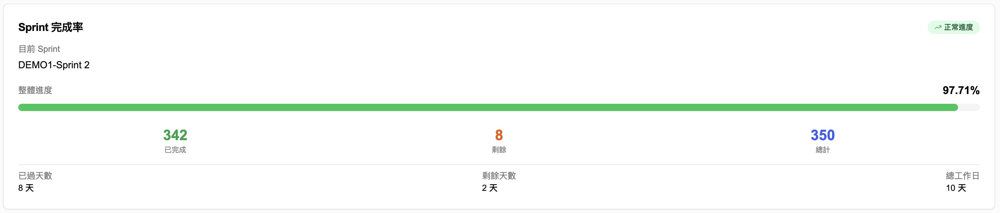
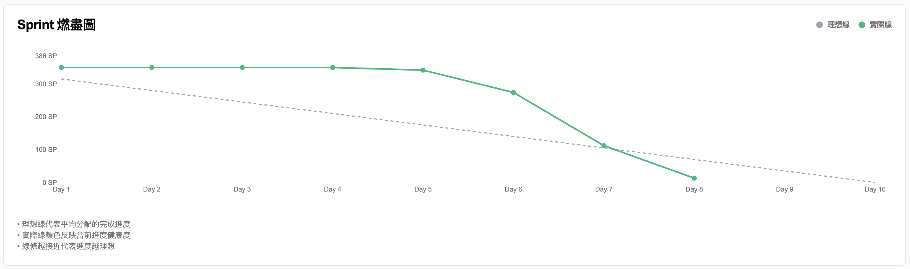
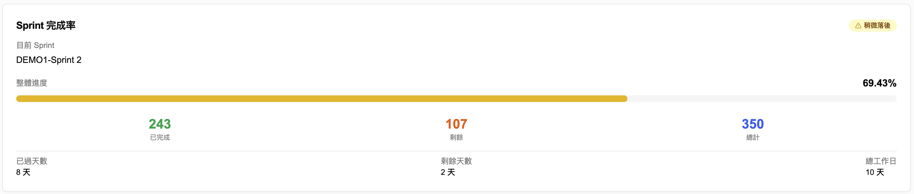
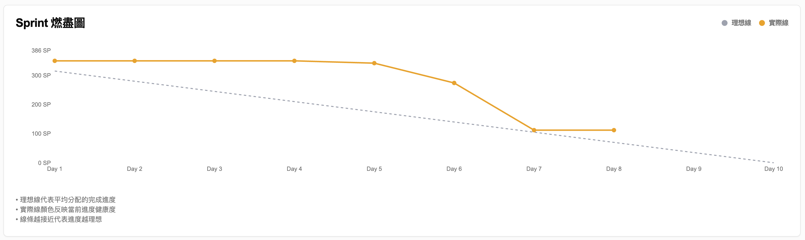
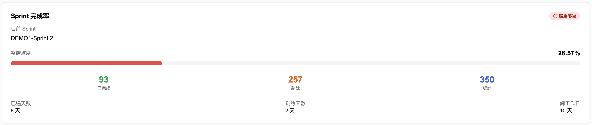
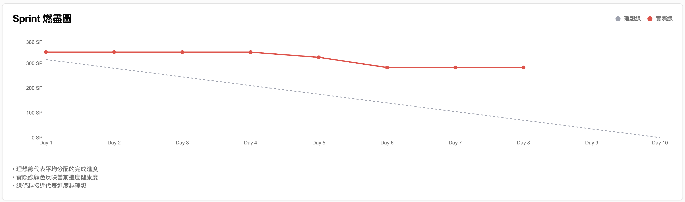

# SPEC-001-Sprint進度視覺化 - Feature Spec

> **檔案編號**: SPEC-001-sprint-progress-visualization  
> **建立日期**: 2025-08-18  
> **最後更新**: 2025-08-28  
> **產品經理**: PM Team  
> **狀態**: 已上線  
> **關聯 PRD**: [FS-001-progress-dashboard](./spec01-progress.md)

## 📝 功能概述

### 需求背景

基於團隊痛點分析發現，成員對 Sprint 進度狀態缺乏明確認知，主要表現為：
1. **短期進度麻木**：無法直觀感受到 Sprint 的時程壓力，導致工作節奏鬆散
2. **危機感不足**：當進度落後時，缺乏即時的視覺警示和團隊討論

這導致團隊在每日站會中流於形式化報告，缺乏對真正障礙的識別和討論。

### 功能描述

提供即時、視覺化的 Sprint 進度儀表板，通過燃盡圖和動態進度條讓團隊能清楚掌握 Sprint 即時狀況，並根據健康狀態提供顏色警示，提升團隊的危機感與緊迫感。

### 預期影響

- **使用者影響**: 團隊成員能即時掌握短期進度，提升時程敏感度和危機感
- **業務影響**: 提升 Sprint 承諾完成率，減少逾期完成的 Issue 數量
- **技術影響**: 需要整合 Google Sheets 資料源，實現即時資料更新和視覺化展示

## 📋 用戶故事 (User Story)

**故事編號**: US001  
**故事標題**: Sprint 燃盡圖視覺化與進度警示  
**Epic**: 進度狀態視覺化儀表板  
**優先級**: High  

**故事描述**:  
*作為 Scrum Master，我希望能在儀表板上看到即時更新的 Sprint 燃盡圖，並根據進度健康狀態顯示不同顏色的進度條和燃盡線，以便在每日站會中快速識別進度是否落後於預期，並引導團隊討論真正的障礙。*

**業務價值**:
- 🎯 提升團隊對 Sprint 進度的敏感度和危機感
- 📈 預期提升 Sprint 承諾完成率 10-15%
- ⚡ 減少站會中的流水帳報告，聚焦真正問題

**依賴關係**:
- ✅ Google Sheets 資料結構已確定
- ✅ .NET 後端 API 基礎架構已完成
- ✅ 前端 React 組件庫已建立

## ✅ Acceptance Criteria (驗收標準)

### AC01: Sprint 燃盡圖正常顯示與健康狀態
```gherkin
場景：Scrum Master 查看正常進度的 Sprint
Given 有一個正在進行的 Sprint
And 實際進度符合或超前理想進度
When Scrum Master 進入儀表板頁面
Then 應顯示完整的 Sprint 燃盡圖
And 燃盡圖顯示灰色虛線理想線
And 燃盡圖顯示綠色實際線（僅到當前工作日）
And 進度條顯示綠色
And 右上角顯示綠色 "正常進度" 健康狀態
And 顯示完成率百分比和故事點數統計
```

### AC02: 進度落後時的黃色警示狀態
```gherkin
場景：Sprint 進度稍微落後的警示
Given 有一個正在進行的 Sprint
And 實際進度落後理想進度 10-25% 之間
When Scrum Master 查看儀表板
Then 進度條應顯示黃色
And 右上角健康狀態 badge 顯示黃色 "稍微落後"
And 燃盡圖實際線應為黃色
And 系統提供適當的警示提醒
```

### AC03: 嚴重落後時的紅色危險警示
```gherkin
場景：Sprint 進度嚴重落後的危險警示
Given 有一個正在進行的 Sprint
And 實際進度落後理想進度 25% 以上
When Scrum Master 查看儀表板
Then 進度條應顯示紅色
And 右上角健康狀態 badge 顯示紅色 "嚴重落後"
And 燃盡圖實際線應為紅色
And 系統提供明顯的危險警示
```

### AC04: 燃盡圖時間邊界正確處理
```gherkin
場景：實際燃盡線只顯示到當前工作日
Given Sprint 為期 10 個工作日
And 今天是第 8 個工作日
When 系統生成燃盡圖資料
Then 理想線應顯示完整的 Day 1 到 Day 10
And 實際線應只顯示 Day 1 到 Day 8 的數據
And Day 9 和 Day 10 不應有實際數據點
And hover 未來日期時應顯示 "實際剩餘: 未來日期"
```

> 💡 **撰寫指引**: 已涵蓋正常流程、健康狀態變化、時間邊界處理和 tooltip 互動

## 🎯 實作規格

### 功能邊界
- **包含範圍**: Sprint 燃盡圖視覺化、健康狀態色彩警示、進度條動態同步、時間進度計時器
- **不包含範圍**: Epic 進度追蹤、歷史趨勢分析、個人績效追蹤、Jira 直接整合
- **影響範圍**: 新增燃盡圖頁面，不影響現有功能

### 技術考量
- **技術限制**: 基於 Google Sheets API 的更新頻率限制，需考慮快取機制
- **效能要求**: 儀表板載入時間 < 3秒，資料更新延遲 < 10秒
- **相容性**: 支援現代瀏覽器，響應式設計支援桌面和平板

### 時程規劃
- **預期完成時間**: 2 週 (已完成)
- **里程碑**: 
  - Week 1: 後端 API 和燃盡圖計算邏輯 ✅
  - Week 2: 前端視覺化和健康狀態同步 ✅

### 相關文件

- **設計稿**: [視覺化 Demo 圖片](../../assets/)
- **API 文檔**: .NET 後端 SprintBurndownResponse API
- **主要 PRD**: [FS-001-progress-dashboard](./spec01-progress.md)
- **測試案例**: [AC-001-sprint-burndown-visualization](./spec01-us01-ac.md)

## 🎨 視覺化示例

### Sprint 進度狀態視覺化

根據 Sprint 健康狀態，系統會自動調整進度條和燃盡圖的顏色：

#### 🟢 正常進度 (Normal)
**完成率進度條:**


**燃盡圖:**


#### 🟡 稍微落後 (Warning)
**完成率進度條:**


**燃盡圖:**


#### 🔴 嚴重落後 (Danger)
**完成率進度條:**


**燃盡圖:**


### 設計原則
1. **一致性**: 進度條顏色與燃盡圖實際線顏色保持一致
2. **直觀性**: 使用通用的紅綠燈色彩系統
3. **即時性**: 顏色狀態會根據實際完成率自動調整
4. **清晰性**: 右上角健康狀態 badge 提供文字說明

## 📊 成效追蹤

### 追蹤指標

- **核心指標**: Sprint 承諾完成率 (Commitment Completion Rate)
- **觀察指標**: 
  - 逾期完成的 Issue 數量
  - Sprint 後期（最後3天）程式碼提交集中度
  - 團隊「任務目標感」問卷評分（1-5分）
  - 每日站會討論障礙的頻率

### 實際成效 (截至 2025-08-28)
- ✅ **功能上線**: Sprint 燃盡圖和進度條顏色同步已完成
- ✅ **視覺一致性**: 三種健康狀態的色彩警示正常運作
- ✅ **技術穩定性**: 解決了 Hydration Mismatch 和 null 值錯誤問題
- 📊 **效果評估**: 待收集 1-2 個 Sprint 的使用數據

## 📝 變更記錄

| 日期         | 版本 | 變更內容 | 變更人    |
| ------------ | ---- | -------- | --------- |
| 2025-08-18   | 1.0  | 初版建立，基於痛點分析 | PM Team |
| 2025-08-28   | 1.1  | 功能開發完成，新增視覺化示例 | Dev Team |
| 2025-08-28   | 2.0  | 根據最新模板重構規格文件 | Dev Team |