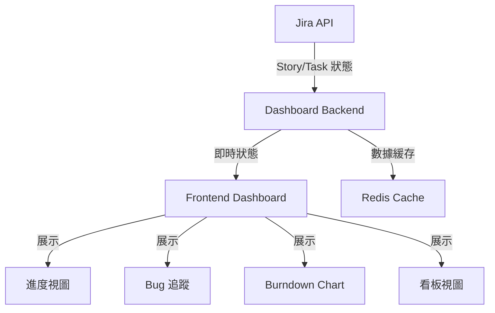

# Sprint Progress & Quality Visibility 技術架構概覽

## 專案定位

這是一個專注於敏捷開發流程可視化的儀表板系統，幫助工程經理更有效地監控和管理 Sprint 進度與品質。

### 系統目標
- **Sprint 進度監控**：即時掌握 Story 和 Subtask 狀態
- **品質追蹤**：監控 Bug 數量和嚴重程度
- **任務優先級管理**：確保團隊專注於重要任務
- **透明化工作流程**：清晰顯示所有工作項目進度

## 系統架構圖

## 核心功能模組

### 1. Story 與 Subtask 管理
- **狀態追蹤**
  - 剩餘時間計算
  - Subtask 狀態同步
  - 異常狀態標示
- **資料同步機制**
  - 即時更新
  - 錯誤處理
  - 緩存策略

### 2. 進度監控系統
- **逾期檢測**
  - 預期完成時間追蹤
  - 臨界點警告
  - 自動標示系統
- **優先級管理**
  - 動態優先級調整
  - 任務分配監控
  - 即時狀態反饋

### 3. 品質追蹤
- **Bug 管理**
  - Bug 關聯系統
  - 嚴重度分類
  - 數量統計
- **Burndown Chart**
  - 即時進度反映
  - 異常區段標示
  - 自動更新機制

## 技術實現

### 前端技術
- **框架**: React + Next.js 15
- **UI 元件**: shadcn/ui
- **狀態管理**: React Context API
- **圖表庫**: Recharts
- **型別系統**: TypeScript

### 後端技術
- **API 服務**: FastAPI
- **資料緩存**: Redis
- **資料處理**: Pandas
- **非同步處理**: asyncio

### 測試框架
- **E2E 測試**: Playwright
- **單元測試**: Jest
- **API 測試**: pytest

## 效能優化

### 資料處理
- **增量更新**: 只同步變更數據
- **批次處理**: 合併多個更新請求
- **緩存策略**: 多層緩存架構

### 前端優化
- **虛擬滾動**: 處理大量數據
- **懶加載**: 按需載入元件
- **狀態本地化**: 減少伺服器請求

## 錯誤處理

### 同步異常
- **重試機制**: 自動重試失敗的同步
- **降級策略**: 當服務不可用時的備用方案
- **用戶通知**: 清晰的錯誤提示

### 資料異常
- **驗證層**: 數據完整性檢查
- **補全機制**: 缺失數據處理
- **異常標記**: 視覺化的異常提示

## 監控與警報

### 系統監控
- **健康檢查**: 定期服務狀態檢查
- **效能指標**: 關鍵指標追蹤
- **錯誤追蹤**: 異常情況記錄

### 業務監控
- **逾期警報**: 自動通知逾期項目
- **進度警報**: Sprint 進度異常提醒
- **品質警報**: Bug 數量超標告警

## 安全性考量

### 存取控制
- **角色權限**: 基於角色的存取控制
- **操作審計**: 重要操作日誌
- **資料加密**: 敏感資訊保護

## 擴展性設計

### 模組化架構
- **獨立服務**: 微服務設計
- **API 版本**: 版本控制機制
- **擴展接口**: 預留擴展點

## 部署架構

### 容器化部署
- **Docker**: 容器化服務
- **Kubernetes**: 容器編排
- **CI/CD**: 自動化部署流程

## 文件與支援

### 技術文件
- **API 文件**: OpenAPI 規範
- **架構文件**: 系統設計說明
- **運維手冊**: 部署與維護指南

### 開發支援
- **開發指南**: 程式碼規範
- **測試指南**: 測試撰寫準則
- **故障排除**: 常見問題解決方案

---

本技術概覽基於現有的 User Stories、Acceptance Criteria 和 Test Cases，提供了完整的技術實現藍圖。系統設計注重可擴展性、可維護性和效能，同時確保了良好的用戶體驗。
